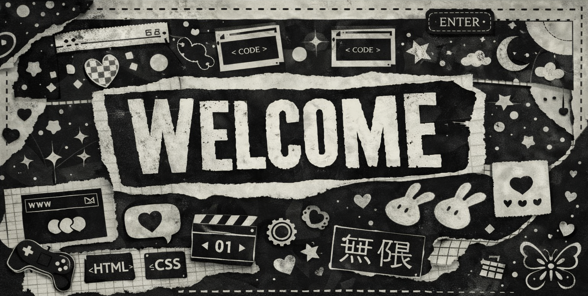

  

<h1 align="center">⋆ 𐙚˚࿔ Hi, I'm Duds 𝜗𝜚˚⋆</h1>
<h3 align="center">Front-end student </h3>

---

### About Me ✮⋆˙

I'm a front-end student in constant learning.  
I have a strong passion for technology and I'm always looking to evolve, improve my skills and grow in the area.

I believe that learning by doing and documenting my journey is the best way to become a better developer every day ♡♡

---

### Connect with me ✌︎㋡

  
  
  

---

### My Journey 𖹭.ᐟ
- Studying Front-end development
- Practicing with real projects
- Improving logic and UI skills
- Building a solid foundation in web development

---

### Languages & Tools I Have Placed My Hands On

  

---

This profile is a reflection of my learning journey ᯓ★

